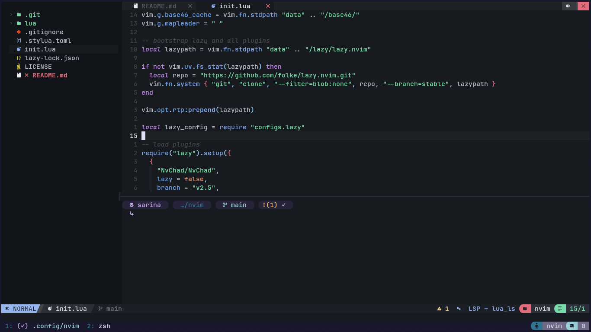
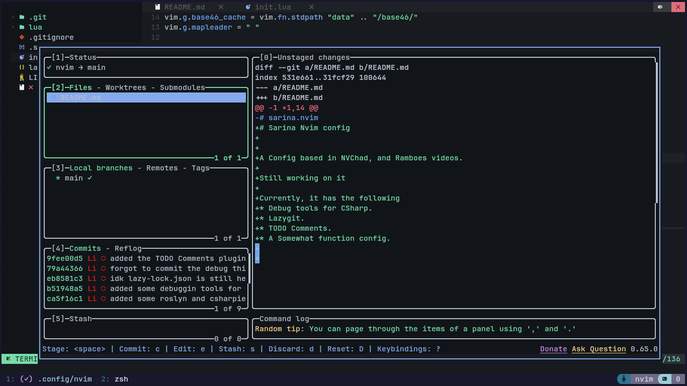

# Sarina Nvim config

A Config based in NVChad, and Ramboes videos.

Still working on it

Main editor

Lazygit

Currently, it has the following
* Debug tools for CSharp.
* Lazygit.
* TODO Comments.
* A Somewhat function config.

